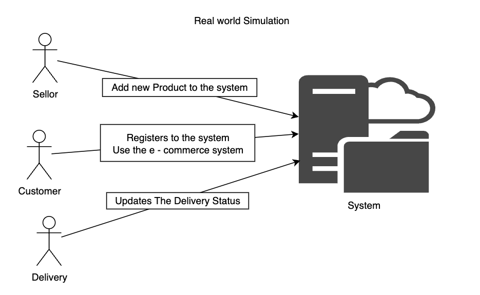

Task C for CSCI318 

* WonbeenLee (8243657)
* Mayowa Adeniyi (7684861)  
* Ethan Luke (6283603)
* Jade Harris (7519084)

___


# Running Instructions
* To run this project, we need Kafka and Zookeeper. Normally, zookeeper is included when you download Kafka.


## 0. Install Dependencies (kafka)


### Macos / Linux

* Using wget :
```shell
wget https://downloads.apache.org/kafka/3.0.0/kafka_2.13-3.0.0.tgz
tar -xzf kafka_2.13-3.0.0.tgz
```

Or

* Go to Kafka Download page :
https://kafka.apache.org/downloads

* Download 3.8.0 binary file ( recommend to install Scala 2.13 )

### Windows

Using windows cmd : 
```cmd
curl -O https://downloads.apache.org/kafka/3.0.0/kafka_2.13-3.0.0.tgz
tar -xzf kafka_2.13-3.0.0.tgz
```

Or

* Go to kafka Download page : 
https://kafka.apache.org/downloads

* Download the binary download file ( Scala 2.13 )

___
## 1. Kafka , Zookeeper Starting

### Macos / Linux

* Move to Kafka binary Directory
```shell
cd kafka_2.13-3.8.0  
```

To run kafka broker, you need to run zookeeper first. 
* Run zookeeper
```shell
bin/zookeeper-server-start.sh config/zookeeper.properties
```

* Open a new Terminal and Run Kafka Message Broker
```shell
bin/kafka-server-start.sh config/server.properties
```

### Windows

* Unzip the file into a directory, e,g `C:\kafka_2.13-3.8.0`

* Open the directory with terminal twice and paste the following commands (one on each window)
```cmd
C:\kafka_2.13-3.8.0\bin\windows\zookeeper-server-start.bat C:\kafka_2.13-3.8.0\config\zookeeper.properties
```
```cmd
C:\kafka_2.13-3.8.0\bin\windows\kafka-server-start.bat C:\kafka_2.13-3.8.0\config\server.properties
```


Before going to next step, lets try adding a new topic and check it can produce - consume properly  
Open Another terminal , go to the same kafka path  

* Create sample topic :\
Macos / Linux : 

```shell
bin/kafka-topics.sh --create --topic test-topic --bootstrap-server localhost:9092 --partitions 1 --replication-factor 1
```

Windows :

```cmd
C:\kafka_2.13-3.8.0\bin\windows\kafka-topics.bat --create --topic test-topic --bootstrap-server localhost:9092 --partitions 1 --replication-factor 1
```

* List all topics to check topic generation\
Macos / Linux :

```shell
bin/kafka-topics.sh --list --bootstrap-server localhost:9092
```

Windows : 

```cmd
C:\kafka_2.13-3.8.0\bin\windows\kafka-topics.bat --list --bootstrap-server localhost:9092
```

* Produce a test message ( producer )\
Macos / Linux :

```shell
bin/kafka-console-producer.sh --topic test-topic --bootstrap-server localhost:9092
```

Windows :

```cmd
C:\kafka_2.13-3.8.0\bin\windows\kafka-console-producer.bat --topic test-topic --bootstrap-server localhost:9092
```

Open Another terminal , go to the same kafka path 
* Consume a test message ( consumer )\
Macos / Linux :

```shell
bin/kafka-console-consumer.sh --topic test-topic --from-beginning --bootstrap-server localhost:9092
```

Windows :

```cmd
C:\kafka_2.13-3.8.0\bin\windows\kafka-console-consumer.bat --topic test-topic --from-beginning --bootstrap-server localhost:9092
```

##### Conclusion: 
We have 4 different terminals opened  
In the Producer Terminal, type a message and press return.  
if the message is appearing at the consumer terminal, then it is ready to execute project  
You can now terminate producer / consumer terminal instance  

___
## 2. Run multiple Projects ( follow command ) 
In this project, there are 5 different microservices included. ( This will be explained more in the below Project Structure section. )  
We will use maven to do the build / run process  

Let's consider you are in the root path : 318TaskC  
Open Terminal for each microservice  

* Before executing microservices, we need to first build shared-events. This is a shared event which will be used for entire kafka broker. 
* This is because, system tries to deserialize the event as a same event.
* Go to shared-events directory and execute below command

Macos / Linux :
```shell
mvn clean install -DskipTests
```

Windows :
```cmd
.\mvnw.cmd clean install -DskipTests
```

Now, we can start running projects
* We Strongly Recommend to run this project in windows / Linux systems. 
* The Api gateway might not properly not work in MacOS environments, especially Apple silicon devices. 
* This is due to **"netty-resolver-dns-native-macos"** dependency.

(For windows, enter the following commands with `mvnw.cmd`)

* ApiGateWay
Linux :
```shell
cd ApiGateWay
mvn clean install
mvn spring-boot:run
```

* OrderService 
```shell
cd OrderService
mvn clean install
mvn spring-boot:run
```

* ProductService
```shell
cd ProductService
mvn clean install
mvn spring-boot:run
```

* ShippingMicroService
```shell
cd ShippingService
mvn clean install
mvn spring-boot:run
```

* UserService
```shell
cd UserService
mvn clean install
mvn spring-boot:run
```


___
## Project Structure


Using the Domain Driven Design Principles and Event Driven Principles,
we have .. 
* Core domain : Order
* Supporting Domain : Product , User , Shipping 
* Generic : Payment ( 3rd party, which will not be implemented, but still Order Microservice has a Rest Client for this)

And we Also have other microservices that are not a part of a problem domain, such as..
* Real Time analysis ( Analysis )
* Api GateWay ( ApiGW ) to route user's Rest calls. 

___

## Sample CURL Api Calls :

* To test the use case, it is critical to first add users and products. ( Peform use case 7 and use case 15 first! )
* Since Each Mircoservice does not have a predefined data inside
* If users and products are not added, It will not properly work. 


### Order Microservice Related

### Use case 1 : **Add new Product to Order**
  
Windows Powershell
```shell
Invoke-RestMethod -Uri 'http://localhost:8080/order/addNew/1/1/1' -Method Patch
```
Windows cmd
```shell
curl --location --request PATCH "http://localhost:8080/order/addNew/1/1/1"
```
MacOs / Linux
```shell
curl --location --request PATCH 'http://localhost:8080/order/addNew/1/1/1'
```

### Use case 2 : **Increase quantity of an existing product in Order**

Windows Powershell
```shell
Invoke-RestMethod -Uri 'http://localhost:8080/order/add/1/1/1' -Method Patch
```
Windows Cmd
```shell
curl --location --request PATCH "http://localhost:8080/order/add/1/1/1"
```
MacOs / Linux
```shell
curl --location --request PATCH 'http://localhost:8080/order/add/1/1/1'
```


### Use case 3 : **Deduct quantity of an existing product in Order**

Windows Powershell
```shell
Invoke-RestMethod -Uri 'http://localhost:8080/order/remove/1/1/1' -Method Patch
```
Windows Cmd
```shell
curl --location --request PATCH "http://localhost:8080/order/remove/1/1/1"
```
MacOs / Linux
```shell
curl --location --request PATCH 'http://localhost:8080/order/remove/1/1/1'
```

### Use case 4 : **Place Order**

Windows Powershell
```shell
Invoke-RestMethod -Uri 'http://localhost:8080/order/placeOrder/1' -Method Patch
```
Windows Cmd
```shell
curl --location --request PATCH "http://localhost:8080/order/placeOrder/1"
```
MacOs / Linux
```shell
curl --location --request PATCH 'http://localhost:8080/order/placeOrder/1'
```

### Use case 5 : **Cancel Order**

Windows Powershell
```shell
Invoke-RestMethod -Uri 'http://localhost:8080/order/cancelOrder/1' -Method Patch
```
Windows Cmd
```shell
curl --location --request PATCH "http://localhost:8080/order/cancelOrder/1"
```
MacOs / Linux
```shell
curl --location --request PATCH 'http://localhost:8080/order/cancelOrder/1'
```

### Product Microservice Related

### Use case 6 : **Add new Product into Product Service**

Windows Powershell
```shell
Invoke-RestMethod -Uri 'http://localhost:8080/product/add' -Method Post -ContentType 'application/json' -Body '{
    "name": "Smartphone",
    "description": "Latest smartphone model",
    "price": 999.99,
    "stock": 50,
    "category": "ELECTRONICS"
}'
```
Windows Cmd
```shell
curl --location "http://localhost:8080/product/add" ^
--header "Content-Type: application/json" ^
--data "{
    \"name\": \"Smartphone\",
    \"description\": \"Latest smartphone model\",
    \"price\": 999.99,
    \"stock\": 50,
    \"category\": \"ELECTRONICS\"
}"
```
MacOs / Linux
```shell
curl --location 'http://localhost:8080/product/add' \
--header 'Content-Type: application/json' \
--data '{
    "name": "Smartphone",
    "description": "Latest smartphone model",
    "price": 999.99,
    "stock": 50,
    "category": "ELECTRONICS"
}'
```

### Use case 7 : **Update Product Stock**

Windows Powershell
```shell
Invoke-RestMethod -Uri 'http://localhost:8080/product/updateStock/1/20' -Method Patch -ContentType 'application/json'
```
Windows Cmd
```shell
curl --location --request PATCH "http://localhost:8080/product/updateStock/1/20" ^
--header "Content-Type: application/json"
```
MacOs / Linux
```shell
curl --location --request PATCH 'http://localhost:8080/product/updateStock/1/20' \
--header 'Content-Type: application/json'
```


### Use case 8 : **Delete Product From Product Service**

Windows Powershell
```shell
Invoke-RestMethod -Uri 'http://localhost:8080/product/delete/1' -Method Delete -ContentType 'application/json'
```
Windows Cmd
```shell
curl --location --request DELETE "http://localhost:8080/product/delete/1" ^
--header "Content-Type: application/json"
```
MacOs / Linux
```shell
curl --location --request DELETE 'http://localhost:8080/product/delete/1' \
--header 'Content-Type: application/json'
```

### Shipping Microservice Related

### Usecase 9 : **Get Shipping Status Of a order**

Windows Powershell
```shell
Invoke-RestMethod -Uri "http://localhost:8080/shipping/getShippingStatus/1" -Method Get
```
Windows cmd 
```shell
curl --location "http://localhost:8080/shipping/getShippingStatus/1"
```

MacOS / Linux
```shell
curl --location 'http://localhost:8080/shipping/getShippingStatus/1'
```


### Usecase 10 : **Mark Shipment as Shipped**

Windows Powershell
```shell
Invoke-RestMethod -Uri "http://localhost:8080/shipping/markAsShipped/1" -Method Patch
```
Windows cmd
```shell
curl --location --request PATCH "http://localhost:8080/shipping/markAsShipped/1"
```

MacOS / Linux
```shell
curl --location --request PATCH 'http://localhost:8080/shipping/markAsShipped/1'
```

### Usecase 11 : **Mark Shipment as Delivered**

Windows Powershell
```shell
Invoke-RestMethod -Uri "http://localhost:8080/shipping/markAsDelivered/1" -Method Patch
```
Windows cmd
```shell
curl --location --request PATCH "http://localhost:8080/shipping/markAsDelivered/1"
```

MacOS / Linux
```shell
curl --location --request PATCH 'http://localhost:8080/shipping/markAsDelivered/1'
```

### User Microservice Related

### Usecase 12 : Add new User

Windows Powershell
```shell
Invoke-RestMethod -Uri "http://localhost:8080/user/add" -Method Post -ContentType "application/json" -Body '{"name": "John Doe", "email": "johndoe@example.com", "phoneNumber": "1234567890", "password": "password123", "userType": "Customer", "address": {"street": "123 Main St", "country": "USA", "state": "NY", "postCode": "10001"}}'
```
Windows cmd
```cmd
curl --location "http://localhost:8080/user/add" --header "Content-Type: application/json" --data-raw "{\"name\": \"John Doe\", \"email\": \"johndoe@example.com\", \"phoneNumber\": \"1234567890\", \"password\": \"password123\", \"userType\": \"Customer\", \"address\": {\"street\": \"123 Main St\", \"country\": \"USA\", \"state\": \"NY\", \"postCode\": \"10001\"}}"
```

MacOS / Linux
```shell
curl --location 'http://localhost:8080/user/add' \
--header 'Content-Type: application/json' \
--data-raw '{
    "name": "John Doe",
    "email": "johndoe@example.com",
    "phoneNumber": "1234567890",
    "password": "password123",
    "userType": "Customer",
    "address": {
        "street": "123 Main St",
        "country": "USA",
        "state": "NY",
        "postCode": "10001"
    }
}'
```

### Usecase 13 : Update User Address

Windows Powershell
```shell
Invoke-RestMethod -Uri "http://localhost:8080/user/updateAddress/1" -Method Patch -ContentType "application/json" -Body '{"street": "Robsons Road", "country": "Australia", "state": "nsw", "postCode": "2500"}'
```
Windows cmd
```shell
curl --location --request PATCH "http://localhost:8080/user/updateAddress/1" --header "Content-Type: application/json" --data "{\"street\": \"Robsons Road\", \"country\": \"Australia\", \"state\": \"nsw\", \"postCode\": \"2500\"}"
```

MacOS / Linux
```shell
curl --location --request PATCH 'http://localhost:8080/user/updateAddress/1' \
--header 'Content-Type: application/json' \
--data '{
    "street": "Robsons Road",
    "country": "Australia",
    "state": "nsw",
    "postCode": "2500"
}'
```

### Stream Processing Related

### Usecase 14 : **Query total Order Numbers Before N minutes**

Windows Powershell
```shell
Invoke-RestMethod -Uri "http://localhost:8080/analysis/getOrderNumbersFromBefore/5" -Method Get
```
Windows cmd
```shell
curl --location "http://localhost:8080/analysis/getOrderNumbersFromBefore/5"
```

MacOS / Linux
```shell
curl --location 'http://localhost:8080/analysis/getOrderNumbersFromBefore/5'
```

### Usecase 15 : **Query total Sales Per Country Before N minutes**

Windows Powershell
```shell
Invoke-RestMethod -Uri "http://localhost:8080/analysis/getCountrySales/Australia/3" -Method Get

```
Windows cmd
```shell
curl --location "http://localhost:8080/analysis/getCountrySales/Australia/3"
```

MacOS / Linux
```shell
curl --location 'http://localhost:8080/analysis/getCountrySales/Australia/3'
```


___ 


## Simulation of Real World & Stream Processing 

* This project includes a file for simulation in the Simulation Directory. 
* The Main.py is used to simulate the real world, where the users from all over the world continuously sending requests
* In this main.py script, it adds a new 19 products to the system, adds new 10 customers , and generated customers send api request asynchronously for every 0.5 seconds.
* After running this script, try Stream processing Related Calls. 




___


#### References : 
https://kafka.apache.org/documentation/

